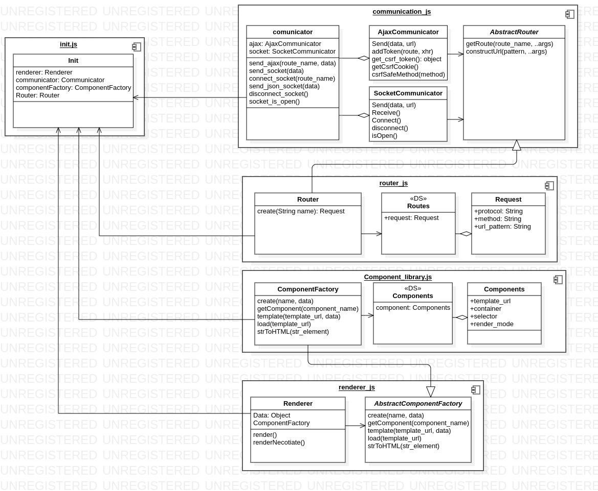

<h1 align="center">
    
</h1>

[](https://github.com/facebook/react/blob/main/LICENSE)

<h1 align="center">
    A Beautiful Django, Vanilla JavaScript Chat Application
</h1>

<br/>
<br/>
<br/>

<p>Tolk is a single page chat web application developed using <a href="https://github.com/django/django">
django web framework</a> and JavaScript.<br/>It uses 
<a href="https://github.com/django/channels">django channles</a> and JavaScript WebSockets to send messages,
notifications,
and status updates. it also comes with two themes Dark Purple and White Light.<br/>
You can check it out in <a href="http://tolk-project.herokuapp.com/">demo</a>.
</p>
<br/>

## Features

- [x] sending/receiving messages
- [x] contacts system
- [x] create groups
- [x] privacy mode
- [x] app notifications
- [x] privacy mode
- [x] dark mode
- [x] API at /api
- [x] send attachments
- [x] single page application
- [x] search

<br/>

## ScreenShot

<hr/>


## Running Tolk locally

<hr/>

clone the repo

```
git clone https://github.com/MuhammadSalahAli/TolkProject.git
```

enter the project's folder

```
cd TolkProject
```

checkout the development branch

```bash
git checkout devleopment
```

install dependencies

```bash
pip install -r requirements.txt
```

now run the development server

```bash
python manage.py runserver
```

visit <a href="http://127.0.0.1:8000/">http://127.0.0.1:8000/</a> and you will see the tolk preloader.


<br/>
<br/>

## Frontend library

<hr/>
The tolk fronted is built using a custom js library in the folder assets/js/app/silly.
The library simply splits html code into templates (i call them components in code) and then renders them 
using the <a href="https://ejs.co/">ejs</a> template engine.
There is also an interface for sending ajax and websocket messages. it's meant to be used to rapidly static 
html pages into dynamically rendered ones.<br/>

<br/>

<p>
 A UML Class Diagram For Silly.
</p>
